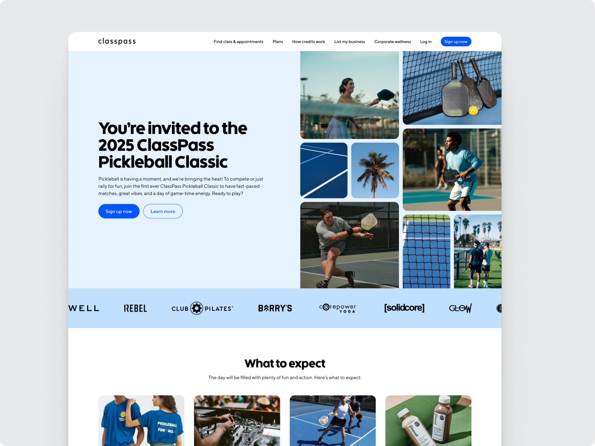

# Coding Test | Pickleball Tournament


<br><br>

This project uses vanilla JavaScript, HTML, and CSS to create a landing page experience for a Pickleball Tournament. It includes the main landing page, a sign up page, and a thank you page.

This project was created with high inspiration from a standard HubSpot CMS theme project and the Airbnb classes organization. Since this project uses vanilla web standards, it does not include any build libraries or frameworks.

## Preview the project

To preview the project to go to this link here: https://monumental-smakager-07938c.netlify.app/

## General References

Here are the design files and assets used as reference:

- Figma file -> https://www.figma.com/design/AZQISVCxEeRHbfJbYtdj8H/CRO-%7C-Figma-Design-for-Coding-Test?node-id=4202-956&t=X8Hh4B2oJ6M0RPaD-1
- Exports on Google Drive -> https://drive.google.com/drive/folders/1MfHkQUVgHuV0deAYotuIM9L_6mQ6amXf?usp=sharing
- Copy doc -> https://docs.google.com/document/d/1_4RWv7Em3wqy7S2Hu89i_NgmbOOxuzbHuM2M0gaq02A/edit?usp=sharing

## File Structure

This is the basic file structure of this project:

```
css/
  generic/
    _reset.css
    _normalize.css
  _variables.css
  _typography.css
  _buttons.css
  _forms.css
  _components.css
  __kitchen-sink.css
  overrides.css
  main.css

images/
  first-party/
    *icons, logos, and other first-party content*
  Logo banner logos/
    *all logos from the logos carousel section*.png
  *all images used in the project*

fonts/
  body/
    *all body fonts*.woff2
  headings/
    *all heading fonts*.woff2

js/
  main.js
  sign-up.js

templates/
  system/
    sign-up.html
    thank-you.html
  landing-page.html
  kitchen-sink.html
```

## How to change colors, fonts, sizes and more?

Pretty much all the styles are defined in the `_variables.css` file. You can change the colors, fonts, sizes, and more by changing the values in this file. All real size values are set in REM units, pixels are only reserved for specific cases and radius.

All icons, main logo and some decorations are following the standard SVG format. Fonts were converted to WOFF2 format for performance reasons.

## How to add forms?

The forms are defined in the `_forms.css` file. Forms follows this structure:

```html
<div class="form contained-form">
  <div class="form--column form--head">
    <h3>Contact information</h3>
    <p>
      The information below will be used to contact you with event updates and
      to let you know your status on the waitlist.
    </p>
  </div>

  <div class="form--row">
    <div class="input--group">
      <input type="text" class="name" required />
      <label for="">First name*</label>
    </div>
    <div class="input--group">
      <input type="text" class="last-name" required />
      <label for="">Last name*</label>
    </div>
  </div>

  <div class="form--row">
    <div class="input--group">
      <input type="text" class="phone" required />
      <label for="">Phone number*</label>
    </div>
  </div>

  <div class="form--row">
    <div class="input--group">
      <input type="email" class="email" required />
      <label for="">Email address*</label>
    </div>
  </div>

  <div class="form--row">
    <div class="input--group">
      <input type="text" class="experience" required />
      <label for="">Pickleball experience level*</label>
    </div>
  </div>

  <div class="form--row">
    <div class="input--group input--group-checkbox">
      <input type="checkbox" class="marketing" required />
      <p>
        I agree to receive marketing and other communications from ClassPass and
        its group companies.*
      </p>
    </div>
  </div>

  <div class="form--row">
    <div class="input--group input--group--textarea">
      <p>
        You can unsubscribe from these communications at any time. For more
        information, please review our Terms of Use and Privacy Policy.
      </p>
    </div>
  </div>

  <div class="form--row">
    <button class="btn btn--full-width">Join waitlist</button>
  </div>
</div>
```

### Structure

By default just adding the "form" class to a div and "form--row" class
to a child div will automatically structure the form field, but we can also add
"contained-form" class alongside with "form" class to add some padding and
essentially make the form contained inside a specific area (based on the Figma
file). Checkboxes and textareas are unique and have their own classes to style
them accordingly -> "input--group--textarea" and "input--group-checkbox".

Just using the form semantic tag will not work, since the form is highly customized using the style pattern of the project.

## How CSS files are organized?

Like mentioned above, this project gets inspiration from a standard HubSpot CMS theme marketplace project, according to HubSpot, it was inspired by the ITCSS methodology. In this project, files "\_" are considered dependent parts that will be merged/imported inside another file. The main file is the `main.css` file, which imports all the other dependent files in the correct order.

Files with "\_\_" are considered specific appendable styles that can be used to specific pages to not affect the overall performance of the project, in this case, we have the kitchen-sink styles that are only used in the kitchen-sink page.

The `overrides.css` file is used to override any style that needs to be changed in the project. This file is the last file to be imported in the `main.css` file and should be used with caution.
